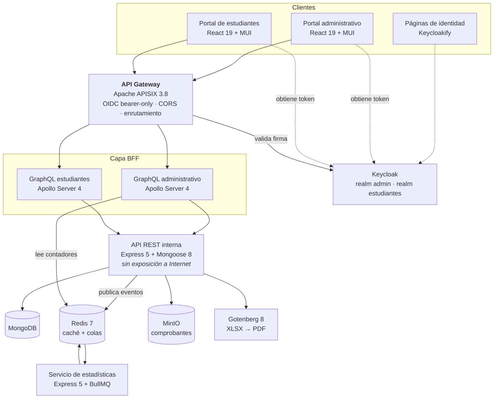

# KAIROS — arquitectura y decisiones técnicas

Plataforma de gestión académica universitaria centrada en el proceso de inscripción: registro del estudiante, verificación de identidad, validación de pagos, selección de materias, control de cupos y emisión de horarios.

Se entrega como servicio. Cada facultad opera una instancia aislada, con su propia base de datos, su propio dominio de identidad y su propia imagen institucional.

Este repositorio no contiene el código fuente. Documenta la arquitectura y, sobre todo, el razonamiento detrás de las decisiones: por qué cada pieza está donde está, qué se evaluó como alternativa y qué costos tiene cada elección. El código es privado porque KAIROS es un producto en comercialización.

## Demostraciones

| Video | Contenido |
|---|---|
| [Ver demo](https://youtu.be/8XvNd6Ab7MM) | *Recorrido completo del proceso de inscripción en KAIROS, desde la perspectiva del estudiante.* |
| [Ver demo](https://youtu.be/yJzey3iGadA) | *Recorrido del proceso de inscripción en KAIROS desde la perspectiva del personal administrativo.* |

---

## El problema

La inscripción universitaria concentra, en una ventana de dos semanas por semestre, casi toda la actividad del año académico. En ese período:

- Prácticamente el total del cuerpo estudiantil se autentica, muchos por primera vez en meses.
- Cada estudiante atraviesa un flujo de varias etapas con aprobación administrativa entre cada una.
- El personal administrativo revisa comprobantes, valida selecciones y asigna cupos en paralelo.
- Fuera de esa ventana, el sistema queda prácticamente ocioso.

Dos consecuencias de diseño se derivan de ahí: la carga es extremadamente estacional, y el pico se concentra en autenticación y lectura, no en escritura de negocio.

---

## Arquitectura

Todo el tráfico externo entra por el gateway. Los servicios internos no tienen puerto expuesto a Internet: aunque alguien obtuviera un token falsificado, no hay superficie contra la cual usarlo.

### Capas

| Capa | Componente | Función |
|---|---|---|
| Presentación | Dos portales React + páginas de identidad Keycloakify | Interfaz administrativa, interfaz de estudiante e imagen institucional en el login |
| Entrada | Apache APISIX 3.8 | Punto único de entrada, validación de tokens OIDC, política de CORS por origen |
| Aplicación | Dos servidores GraphQL (uno por portal) | Fachada por perfil de usuario sobre la API interna |
| Aplicación | API REST + servicio de estadísticas | Lógica de negocio y procesamiento asíncrono de eventos académicos |
| Datos | MongoDB · Redis 7 · MinIO | Persistencia, caché y colas, almacenamiento de comprobantes |

---

## Por qué Keycloak

El punto de partida importa: **antes de KAIROS escribí mi propia autenticación con JWT**, con emisión, revocación en dos niveles, recuperación de contraseña por correo y expiración de sesiones. Funcionaba. La decisión de no volver a hacerlo no viene de desconocer el trabajo, sino de haberlo hecho y saber lo que cuesta mantenerlo.

### 1. El aislamiento entre instituciones es un dominio de identidad, no una columna

Cada facultad opera con su propio *realm*: usuarios, credenciales, políticas de contraseña, duración de sesión y clientes OAuth separados a nivel del proveedor de identidad.

La alternativa habitual —una tabla de usuarios compartida con un campo `institucion_id`— deja el aislamiento en manos de que ninguna consulta olvide el filtro. Un solo `WHERE` incompleto expone datos de otra institución. Con realms separados, la separación no depende de la disciplina del código de aplicación: un token emitido para una facultad simplemente no valida contra el dominio de otra.

Para un producto que vende aislamiento institucional como característica, y que va a ser auditado por el equipo técnico de cada facultad, la diferencia entre "está aislado" y "está aislado por construcción" es la diferencia entre pasar o no pasar la evaluación.

### 2. Dos poblaciones de usuarios con ciclos de vida incompatibles

Dentro de cada instancia hay dos realms: personal administrativo y estudiantes.

Son poblaciones con requisitos opuestos: el personal administrativo es un grupo pequeño y estable, con privilegios altos, que justifica políticas de contraseña estrictas y sesiones cortas. El cuerpo estudiantil es masivo, rotativo y entra pocas veces por semestre; políticas idénticas a las del personal generan una avalancha de recuperaciones de contraseña justo en el pico de inscripción.

Con realms separados cada población tiene su política, y el compromiso de una no toca a la otra. Implementar eso sobre una autenticación propia significa mantener dos configuraciones paralelas de reglas, expiraciones y flujos de recuperación en código de aplicación.

### 3. Validación en el gateway: cero código de autenticación en los servicios

APISIX valida cada token en modo *bearer only* antes de enrutar. Los servicios de negocio no verifican firmas, no manejan claves y nunca ven una credencial.

Esto tiene una consecuencia práctica que pesa más de lo que parece: **cuando aparece una vulnerabilidad en la autenticación, se corrige en un solo lugar.** En una arquitectura de microservicios con autenticación propia, cada servicio nuevo es una oportunidad de introducir un error de validación, y cada corrección hay que replicarla en todos.

### 4. Personalización institucional sin duplicar el login

Cada facultad necesita su imagen en las pantallas de acceso. Con Keycloakify, las páginas de login, registro, recuperación y verificación se construyen como una aplicación React compilada a un tema de Keycloak.

Un solo conjunto de pantallas, parametrizado por instancia, en lugar de un formulario de login reimplementado dentro de cada portal.

### 5. El protocolo estándar abre puertas que hoy están cerradas

Keycloak habla OpenID Connect y SAML. Eso significa que integraciones que hoy no están en el alcance dejan de ser reescrituras y pasan a ser configuración:

- Federación con el directorio institucional existente, si la universidad ya tiene uno.
- Inicio de sesión único con otros sistemas de la facultad.
- La vista consolidada prevista para una instancia central, construida sobre intercambio de credenciales entre dominios de identidad, sin unificar bases de datos ni quitarle el control a ninguna facultad.

---

## Lo que cuesta Keycloak

Una decisión sin costos declarados es una decisión mal explicada.

- **Operación.** Keycloak es un servicio más que mantener: actualizar, respaldar su base de datos, vigilarlo. Un proveedor gestionado no requiere nada de eso.
- **Curva de aprendizaje.** El modelo de realms, clientes, roles, ámbitos y flujos de autenticación es extenso. La configuración inicial lleva considerablemente más tiempo que registrar una aplicación en un servicio gestionado.
- **Punto único de falla.** Si Keycloak cae, no entra nadie. Exige redundancia real, no una sola instancia.
- **Consumo de recursos.** Es una aplicación Java; su huella de memoria es sensiblemente mayor que la de los servicios Node del resto del sistema.

---

## Otras decisiones de arquitectura

### BFF por portal en lugar de un esquema GraphQL compartido

Cada portal consume su propio servidor GraphQL. Las operaciones administrativas no existen en el esquema que ve el portal de estudiantes.

La alternativa —un esquema único con autorización por campo— deja la seguridad dependiendo de que cada resolver verifique correctamente el rol. Con esquemas separados, una operación administrativa no está oculta para el estudiante: no está disponible. La superficie de ataque se reduce en el diseño y no en la lógica.

El costo es duplicación: dos servidores que mantener y tipos compartidos que sincronizar.

### Estadísticas fuera del camino crítico

Las operaciones sobre inscripciones, cursos y estudiantes publican eventos en colas BullMQ. Un servicio independiente los consume y mantiene contadores agregados en Redis.

El panel administrativo se consulta constantemente durante la inscripción, justo cuando las operaciones de escritura son críticas. Calcular esos indicadores por agregación en el momento de la consulta pone al panel a competir con las inscripciones por los mismos recursos, exactamente en el pico. Precalcularlos de forma asíncrona traslada ese trabajo fuera de la ruta que no puede degradarse.

El costo es consistencia eventual: los contadores pueden ir unos segundos por detrás. Para indicadores de panel es aceptable; para control de cupos no lo sería, y por eso los cupos se verifican contra el límite del curso en la operación misma, no contra el contador.

### Una instancia por facultad

Base de datos, dominio de identidad y almacenamiento de archivos independientes por institución.

Multiplica el costo de infraestructura y el trabajo de despliegue frente a un único sistema multi-inquilino. A cambio, elimina la clase completa de errores de fuga entre inquilinos, permite que cada facultad fije su región de alojamiento y su calendario de respaldos, y hace que la migración de una institución que decide irse sea una exportación, no una extracción selectiva.

### MongoDB

La configuración académica varía entre facultades: reglas de cupo, campos de los métodos de pago, estructura de prerrequisitos. Un esquema flexible evita una migración por cada institución que se incorpora.

La contrapartida es que las garantías de integridad hay que sostenerlas explícitamente. Los prerrequisitos se modelan como relaciones entre materias, y la unicidad de inscripción por estudiante, semestre y materia se impone con un índice único en la base de datos, no con una comprobación en el código de aplicación —que en condiciones de concurrencia no alcanza.

---

## Alcance declarado

KAIROS no gestiona calificaciones y no se integra automáticamente con los sistemas académicos existentes de la facultad. La validación del cumplimiento efectivo de prerrequisitos la realiza el personal administrativo consultando sus propios sistemas, dentro del paso de revisión.

Es una limitación deliberada. A cambio, la puesta en marcha no exige desarrollo de integraciones, ni acceso a las bases de datos de la facultad, ni modificaciones sobre sistemas en producción: el riesgo operativo sobre lo existente es nulo.

---

## Estado

Producto en desarrollo activo, en etapa de evaluación con instituciones. El código fuente es privado.

Para demostración técnica guiada o revisión de aspectos específicos de la arquitectura: **palmaluis0107@gmail.com**